**ACTIVIDAD 2**

**Tipo actividad: Taller de consultas SQL**

**Taller de consultas SQL**

Utilizando el editor de consultas (queries) que se puede ver en la figura 7 orientar a los estudiantes para que, escriban consultas SQL que permitan responder las siguientes preguntas: 

1. Ejecutar y revisar el resultado de las siguientes consultas: 

SELECT \* FROM Invoice;

SELECT \* FROM Employee;

SELECT BILLINGCOUNTRY,

  	COUNT(INVOICEID)

  FROM INVOICE

  GROUP BY 1  ORDER BY 2 DESC
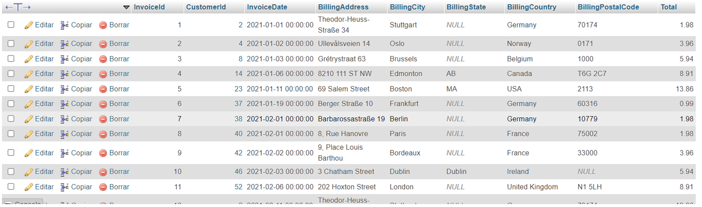

2. ¿Qué país tiene más facturas?

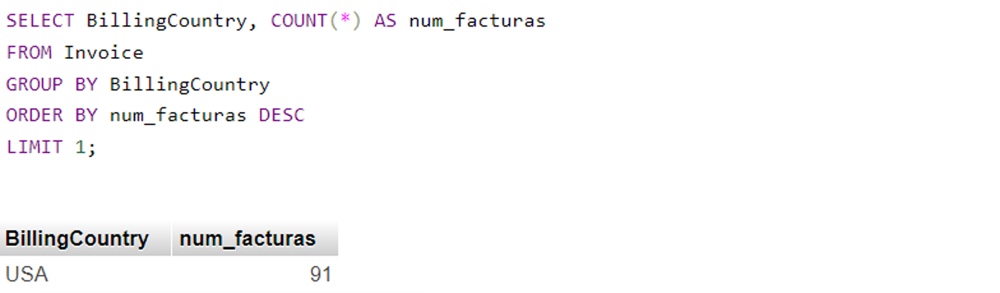

3. se quiere promocionar un nuevo festival musical, para ello es necesario saber en qué ciudad  hay mas facturas (invoices) . determinar en qué ciudad la suma de facturas es la mayor.

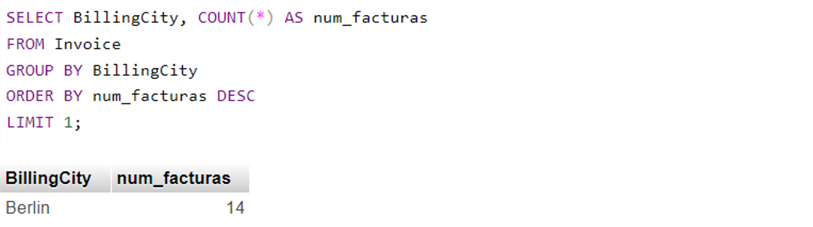

4. Determinar quien es el mejor cliente (el que mas ha gastado en el sistema)  
   CON AYUDA DE CHAT GPT:  
   **SELECT CustomerId, FirstName, LastName, SUM(Total) AS TotalSpent**  
   **FROM Invoice**  
   **JOIN Customer ON Invoice.CustomerId \= Customer.CustomerId**  
   **GROUP BY CustomerId**  
   **ORDER BY TotalSpent DESC**  
   **LIMIT 1;**  
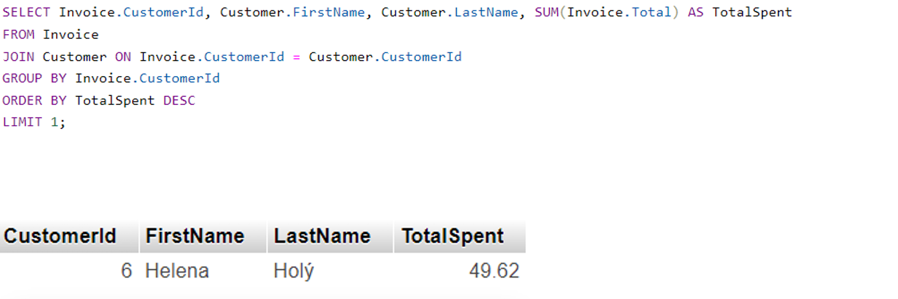

5. Obtener una tabla con el correo, nombre y apellido de todos las personas que escuchan Rock. Retornar la lista por orden alfabético

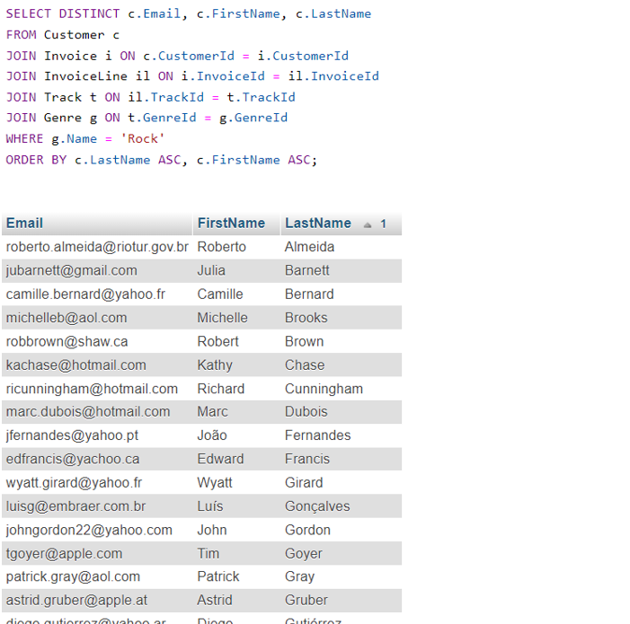

6. Sacar una lista con todos los artistas que generan música rock

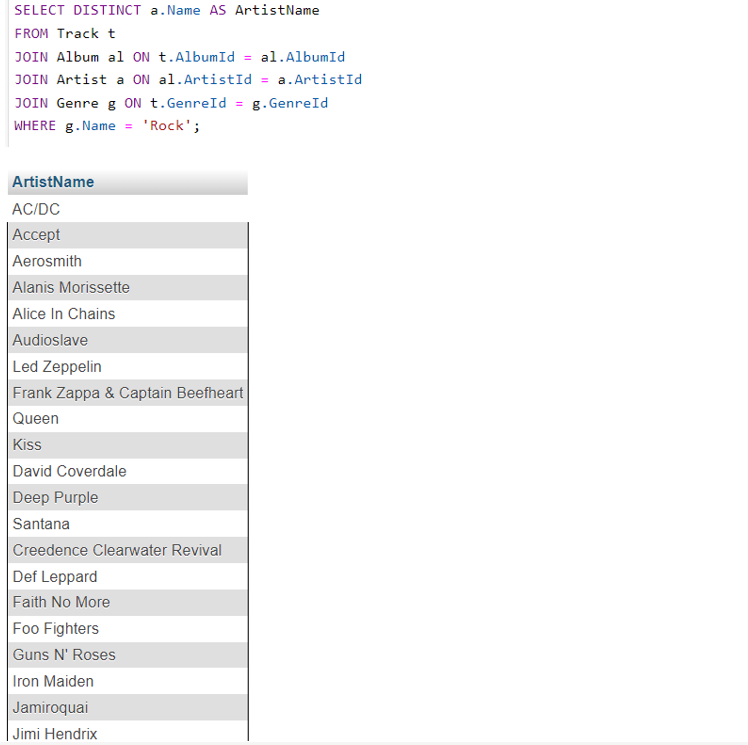

7. Encontrar cual es el artista que más ha ganado de acuerdo al campo invoiceLines.

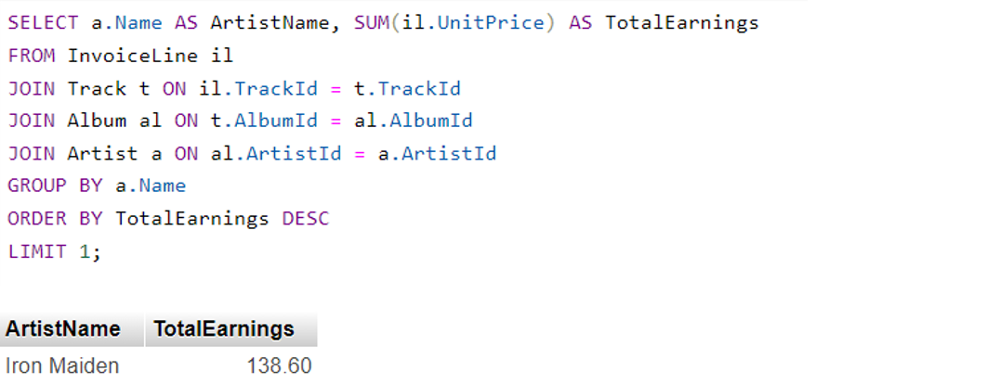

8. Encontrar cuanto gastaron en total en estados unidos en compras

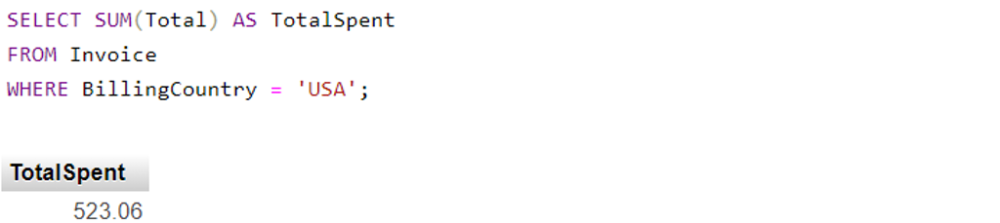

9. Encontrar cuánto gastaron los usuarios por género.

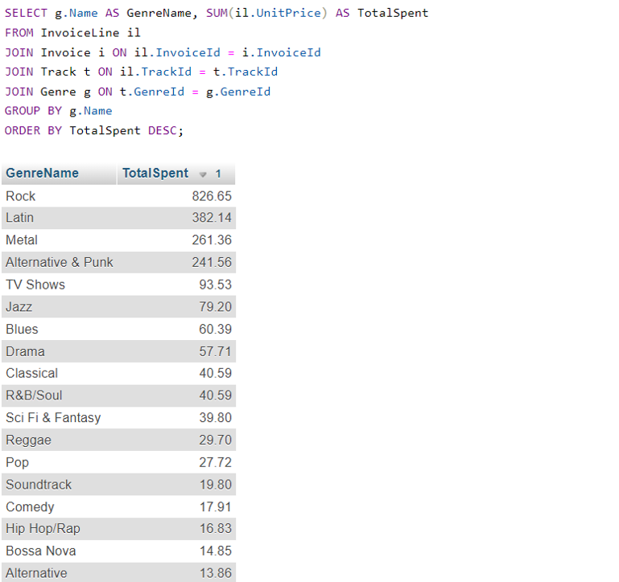

10. Generar una tabla con el conteo de usuarios por cada país.

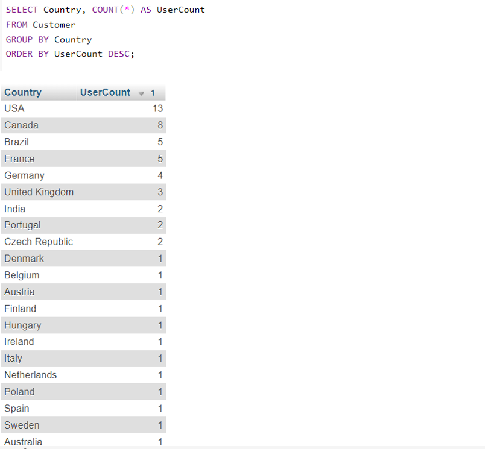

11. Encontrar cuantas canciones hay por cada género.

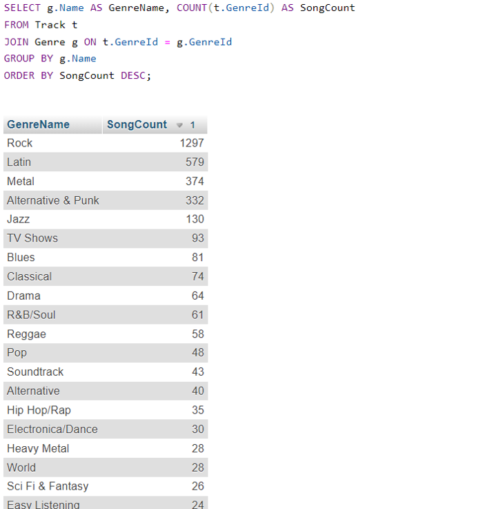

